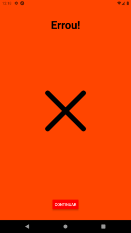

Tecnologia em Análise e Desenvolvimento de Sistemas

Setor de Educação Profissional e Tecnológica - SEPT

Universidade Federal do Paraná - UFPR

---

*DS151 - Desenvolvimento para Dispositivos Móveis*

Prof. Alexander Robert Kutzke

* [Instruções para submissão de tarefas e trabalhos](https://gitlab.tadsufpr.net.br/ds122-alexkutzke/material/blob/master/instrucoes_submissao_tarefas_e_trabalhos.md)
* [Video aula](https://www.youtube.com/watch?v=d6ZTnQNhoCo)

# (Simulação) Avaliação Flag Game 

Utilize o projeto já existente nesse repositório e implemente a aplicação abaixo. O jogo consiste em 10 perguntas com 4 opções para identificação de qual país a bandeira mostrada pertence. Cada acerto soma 1 ponto. Ao final, mostra-se a pontuação e dá a opção de iniciar novamente ou encerrar voltando à tela inicial.


## Layout





## Imagens das bandeiras

As imagens das bandeiras podem ser requisitadas pela seguinte API pública: https://countryflagsapi.com/
A URL das imagens é aceita como parâmetro para o componente `Image`, portanto, **não** é necessário realizar requisições HTTP, com o `axios`, por exemplo, para exibir as imagens.

A lista dos países pode ser encontrada no array presente no arquivo `countries.js`.
Para utilizá-lo, basta utilizar um `import` similar ao seguinte:

```js
import {countries} from 'CAMINHO/PARA/countries';
```

Substitua `CAMINHO/PARA/` com o caminho correto para o arquivo.

## Biblioteca underscore.js

Para operações com Array, como [`shuffle`](https://underscorejs.org/#shuffle) e [`sample`](https://underscorejs.org/#sample), é possível utilizar a biblioteca [Underscore.js](https://underscorejs.org/). Consulte a documentação para sintaxe e funcionamento.

O arquivo da biblioteca já está presente no repositório, e pode ser importado da seguinte forma:

```js
import _ from 'CAMINHO/PARA/underscore-esm-min';
```

Substitua `CAMINHO/PARA/` com o caminho correto para o arquivo.

## Lembrando

Faça o fork do projeto, salve no seu grupo da disciplina.
Após, clone o projeto e execute o seguinte:

```
npm install
expo start
```
